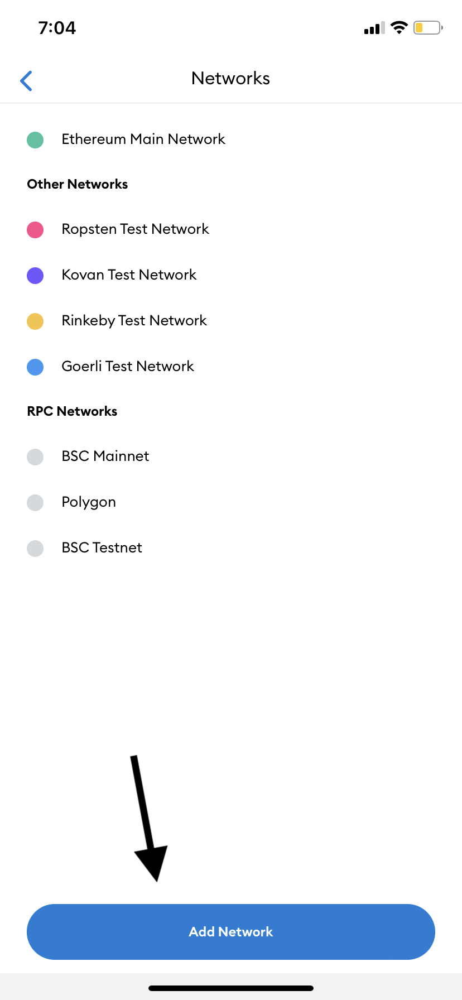
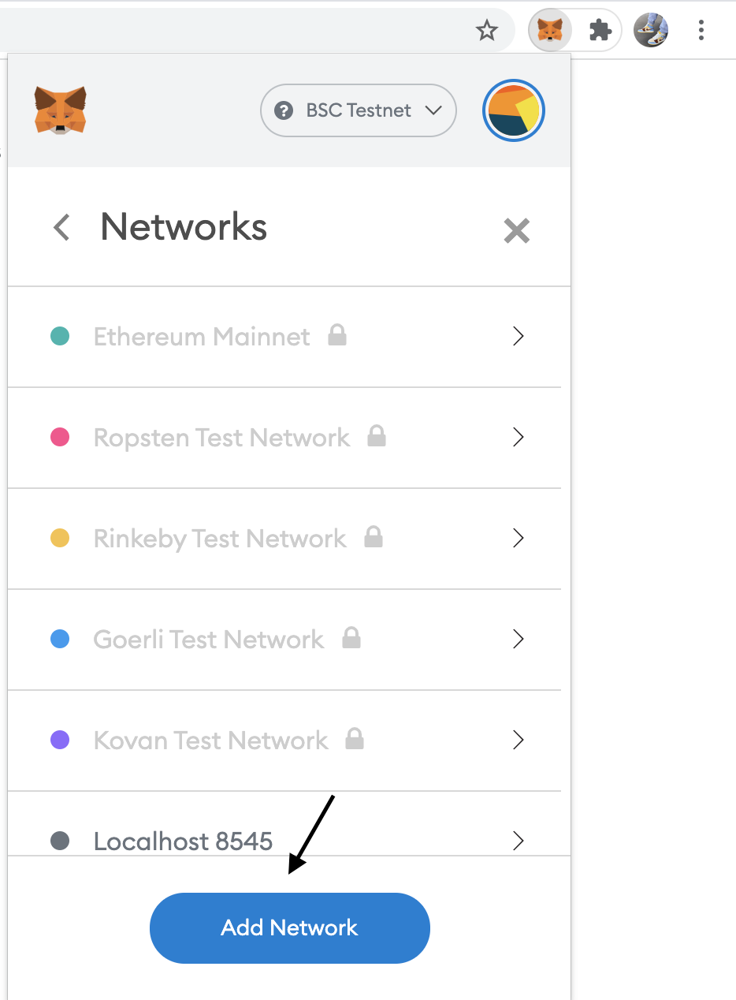
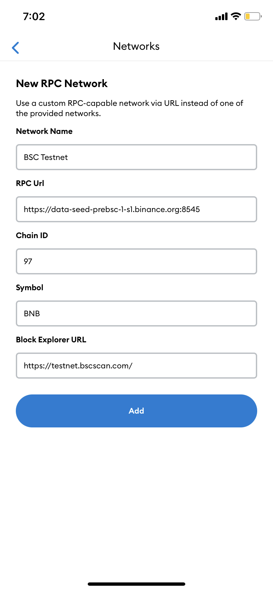
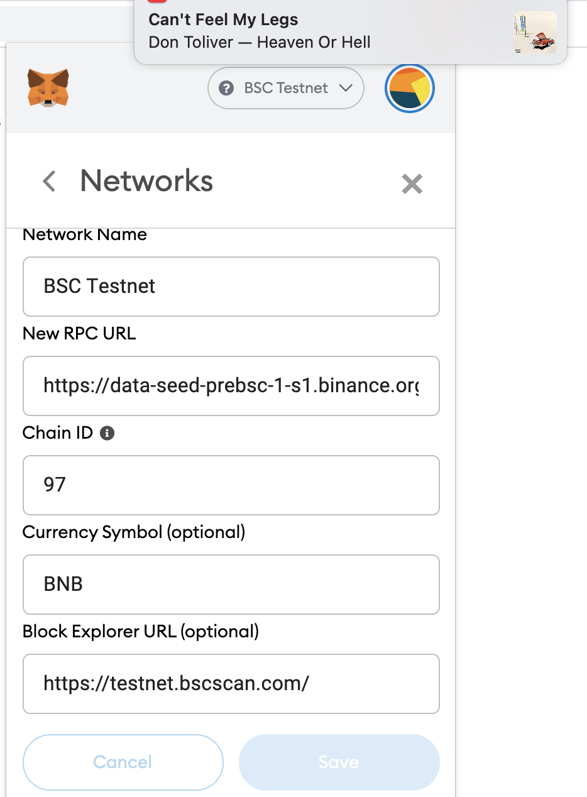
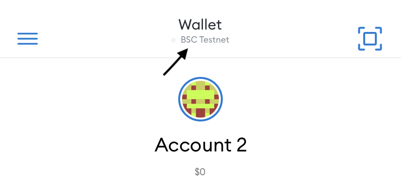
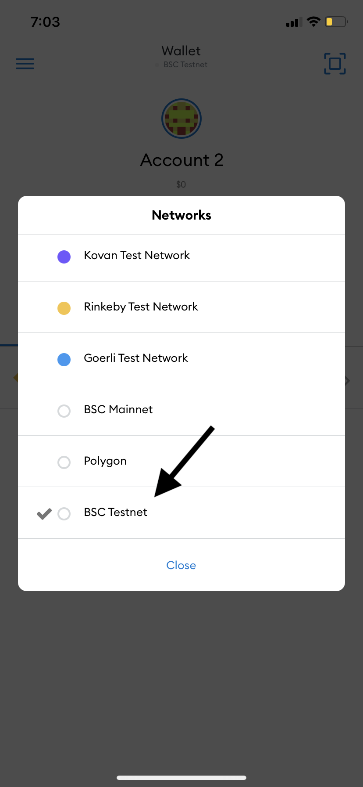
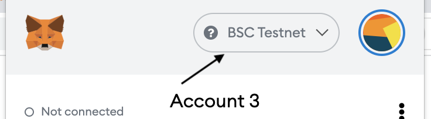
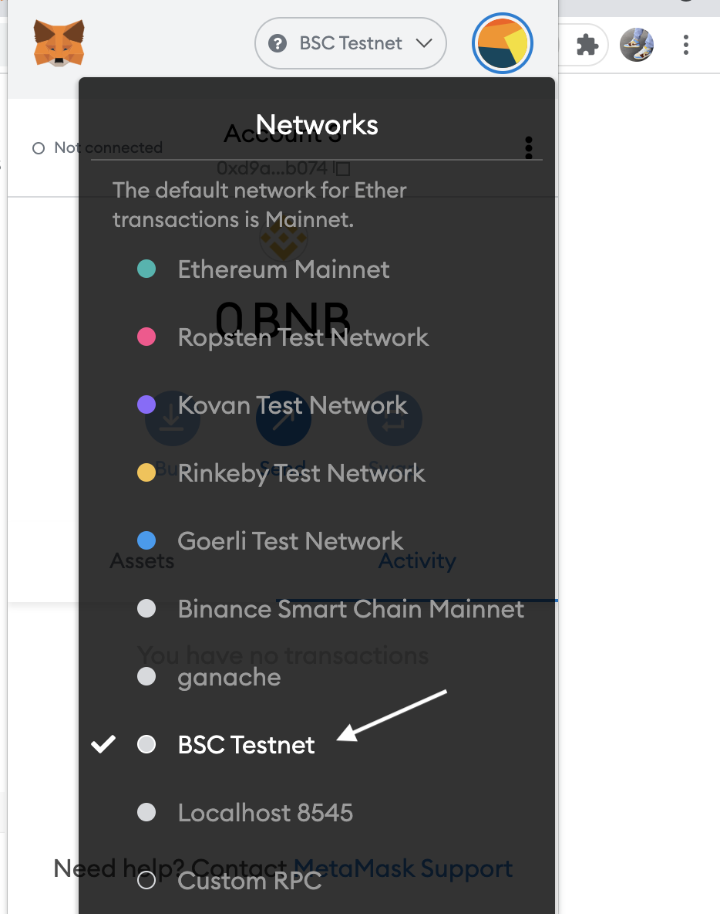

# Creo Farm Ui

## How to set up BSC network for mainnet and testnet (metamask):

Download Metamask For Mobile/PC [here: https://metamask.io/](https://metamask.io/)

### 1) Navigate to Metamask -> Settings -> Networks, click on add Network.

#### Mobile



#### Web



### 2) Input the following variables as shown below

#### testnet

```
Network Name : BSC Testnet
New RPC URL : https://data-seed-prebsc-1-s1.binance.org:8545
Chain ID : 97
Currency Symbol: BNB
Block Explorer: https://testnet.bscscan.com/
```

#### mainnet

```
Network Name : BSC Mainnet
New RPC URL : https://bsc-dataseed1.ninicoin.io
Chain ID : 56
Currency Symbol: BNB
Block Explorer: https://bscscan.com/
```

#### Mobile



#### Web



### 3) Switch to bsc network as shown below.

#### Mobile

1. Click on the current network shown on top section of your wallet



2. Select Bsc testnet or Bsc Mainnet (Whichever you're willing to interact with)



#### Web

1. Click on the current network shown on top section of your wallet



2. Select Bsc testnet or Bsc Mainnet (Whichever you're willing to interact with)




### 3) Send bnb to your wallet for transaction fees.

### testnet: Get free testnet bnb from [here: BNB Faucet](https://testnet.binance.org/faucet-smart). Paste in your wallet and claim testnet bnb.
#### Note: Testnet Creo token and testnet creo lp token will be airdropped to users that requested access to testnet farm pools.

### Mainnet: Fund your wallet with bnb from any preferred exchange.
#### Buy Creo on [Pancakeswap](https://pancakeswap.finance/swap?outputCurrency=0xcb95881d76f93a401bbd47a2eb69fc33e9476795&inputCurrency=BNB)

#### Add Creo-BNB liquidity on [Pancakeswap liquidity](https://pancakeswap.finance/add/BNB/0xcB95881D76f93a401BBd47A2eB69FC33e9476795)
